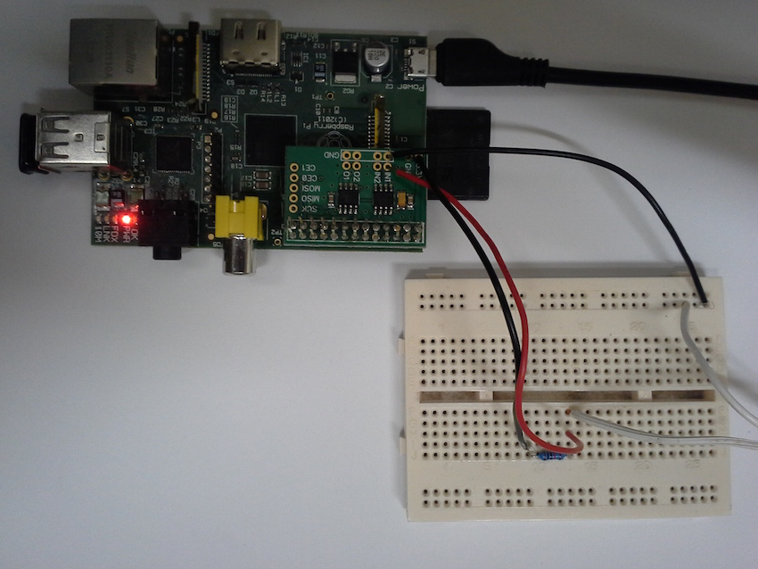

# Objectif

Créer un collecteur de données de consommation électrique (presque) instantannée et comptant les impulsions correspondant à 1Wh consommé. Le compteur électrique fournit ces impulsions sous forme d'un clignotement (flash) d'une LED rouge. Il suffit donc de détecter ces flash à l'aide d'une photorésistance pour obtenir la consommation Wh par Wh.

Le système est entièrement autonome, il est composé d'un raspberry pi couplé à une photorésistance via un convertisseur AD. Les données collectées sont stockées localement sur la carte SD du pi. Les données peuvent être transférée sur un autre ordinateur par sftp via une connexion wifi du pi.

# Utilisation du collecteur de données

Lancer le collecteur avec 

```sh
sudo PYTHONPATH=.:/home/pi/ABElectronics_Python_Libraries/ADCDACPi/ python monitor.py
```

Le collecteur crée des fichier JSON, un par jour, nommés data-_data de création_.json, par exemple

data-2015-04-29 00:00:01.729281.json

# Matériel utilisé

- raspeberry pi
- convertisseur ADCDAC - ADC-DAC Pi acheté chez AB Electronics (GBP 11.40 + 5.95 port) https://www.abelectronics.co.uk/products/3/Raspberry-Pi/39/ADC-DAC-Pi-Raspberry-Pi-ADC-and-DAC-expansion-board
- photorésistance PHOTORES.A.90DIAM:5 MM 1  chez Conrad
- connecteur wifi pour raspeberry EDIMAX Clé USB WIFI EDIMAX N150 EW-7811U chez Conrad
- résistance 10kOhms (je crois)
- breadboard

## schéma électronique

Voir photo (les fils blanc vont vers la photorésistance)



```
 3.3V ----- 10kO ------------ [Photores] -------- GND
                     |
                     |
                    IN1
```

# Algorithme

Lorsque la photorésistance est éclairée par la diode rouge du compteur (un flash pour 1Wh consommé) la tension chute (par exemple de 2.5V à 1V sur mon installation). Pour détecter un flash la méthode général est 

- lisser la courbe des tensions mesurées à intervalles réguliers (deltaT = 0.001) 
- détecter une chute continue de tension d'au moins vThreshold volts (vThreshold = 0.3V)

Le lissage se fait en calculant la moyenne de n dernière mesures (n=4 pour l'instant)

Une séquence de mesures (v[1], ..., v[k], v[k+1]) est une détection de flash si
  - v[i+1] <= v[i], i=1, k-1
  - v[k+1] > v[k]
  - v[1] - v[k] > vThreshold
  
La puissance moyenne entre ce flash et le précédent est 1/(t1-tpred) où t1 est le temps (en secondes) de la mesure v[1] et tpred est le temps du flash précédent. 1 est le nombre de Wh entre deux flash.

# Quelques informations d'installation

## Bibliothèque d'accès au convertisseur AD/DA

Référence: https://www.abelectronics.co.uk/products/3/Raspberry-Pi/39/ADC-DAC-Pi-Raspberry-Pi-ADC-and-DAC-expansion-board

git clone https://github.com/abelectronicsuk/ABElectronics_Python_Libraries.git


## PYTHONPATH

Pour que ça marche il faut faire

sudo PYTHONPATH=.:/home/pi/ABElectronics_Python_Libraries/ADCDACPi/ python demo.py

parce que l'environmment n'est pas transmis à travers la commande sudo. Et il faut
être superuser car la bibliothèque ADCDAC fait des accès mémoire dis.

## HTTP et Python

Pour envoyer des requêtes http par python, 

installer requests

$ git clone git://github.com/kennethreitz/requests.git
$ cd requests
$ python setup.py install


# Visualisation


